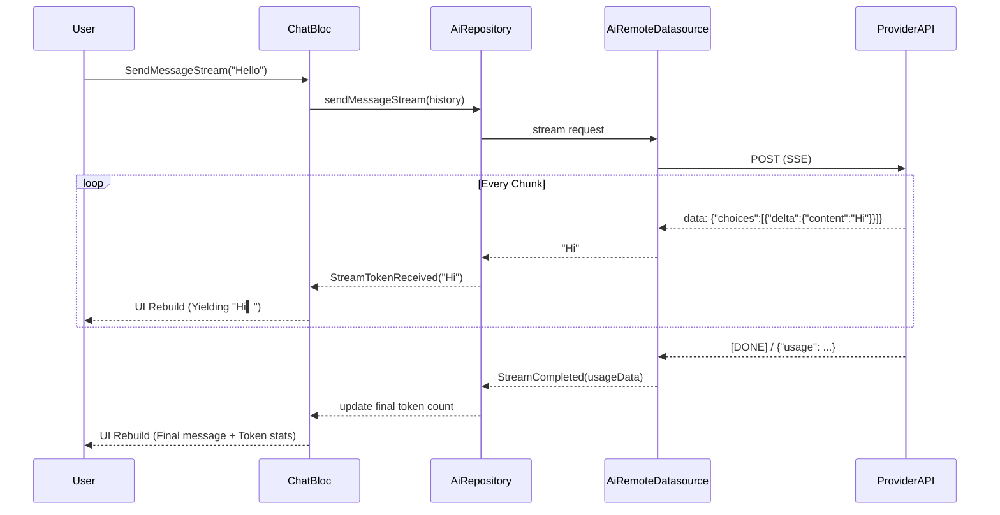

# AI Usage

This document outlines how AI models are integrated into AXON, including the implementation of features like streaming generation, context tracking, system prompts, image processing, and error handling.

## Provider Support

AXON uses an abstraction layer (`AiRepository`) to communicate with different AI providers, allowing seamless swapping of models.

The current implementation natively supports:
- **OpenAI-compatible APIs**: E.g., OpenAI, LM Studio, Ollama, Groq.
- **Google Gemini APIs**: Deep integration for the Gemini Pro/Flash family, utilizing `generateContent` and `streamGenerateContent` endpoints.

The active provider is determined dynamically per message or conversation, using the settings managed by `SettingsBloc`.

## Core AI Features

### 1. Streaming Responses (SSE)

Real-time streaming is critical for a responsive chat experience. This is achieved via Server-Sent Events (SSE).

- **Implementation**: The `AiRemoteDatasourceImpl` uses the Dio HTTP client configured with `ResponseType.stream`.
- **Parsing**: The incoming byte stream is decoded via `utf8.decoder` and split by `LineSplitter`. For OpenAI, it parses lines starting with `data: `, decodes the JSON payload, and extracts the `choices[0].delta.content`. For Gemini, a similar approach parses the `streamGenerateContent` JSON payload.
- **State Management**: The stream tokens are pushed to a `StreamController`. The `ChatBloc` listens to this stream, accumulating tokens into a string buffer and emitting `ChatStreaming` states.
- **UI**: The `MessageBubble` or `_StreamingMessage` widget re-renders on each emission, producing the typing effect with a custom blinking cursor (`▍`).

### 2. Multi-modal Inputs (Vision)

AXON supports sending images and files to models with vision capabilities (like `gpt-4o` or `gemini-1.5-pro`).

- **Attachment Handling**: Images are picked via `image_picker` or `file_picker`.
- **Encoding**: Before dispatch, local files are read as bytes and converted to Base64 (`base64Encode`).
- **Payload Construction**:
  - For **OpenAI**, the Base64 string is wrapped in an `image_url` data URI (`data:image/jpeg;base64,...`).
  - For **Gemini**, the Base64 string is passed via `inline_data` alongside the `mime_type`.

### 3. Rate-Limit Backoff (429 Handling)

When a provider returns a `429 Too Many Requests` error, AXON implements a graceful fallback.

- **Detection**: The Dio error handler intercepts 429 status codes and throws a specific `RateLimitException`.
- **Bloc Coordination**: The `ChatBloc` catches this exception and starts a `_backoffTimer` (e.g., 5 seconds for the first retry).
- **UI Countdown**: During the backoff, `ChatBloc` emits `RetryCountdownTick` events every second. The `_ErrorBar` in `ChatScreen` shows a live countdown (e.g., "retrying in 3s...").
- **Automatic Retry**: When the timer hits 0, `ChatBloc` automatically dispatches a `RetryLastMessage` event.

### 4. System Prompts & Personas

Users can influence the AI's behavior per conversation.

- **System Messages**: Standardized as `MessageRole.system`.
- **Injection**: When sending a message array to the provider, `ChatBloc` prepends the conversation's active system prompt (if any) as the very first message.
- **Personas**: The UI provides preset templates (e.g., "Socratic Tutor", "Code Reviewer"). When a user selects a persona, it overwrites the conversation's system prompt in local storage and memory.

### 5. Token Usage Tracking

AXON parses token usage from the API to give users visibility into cost.

- **Extraction**:
  - OpenAI: Parses the `usage.total_tokens` field from the final chunk in a stream or a standard JSON response.
  - Gemini: Parses `usageMetadata.totalTokenCount`.
- **Domain Mapping**: The count is stored in the `AiResponse` class and subsequently saved to the `Message` domain entity.
- **Display**: The `MessageBubble` shows individual message cost, and the `ChatScreen` footer aggregates the total token count for the active session.

## Data Flow Diagram

